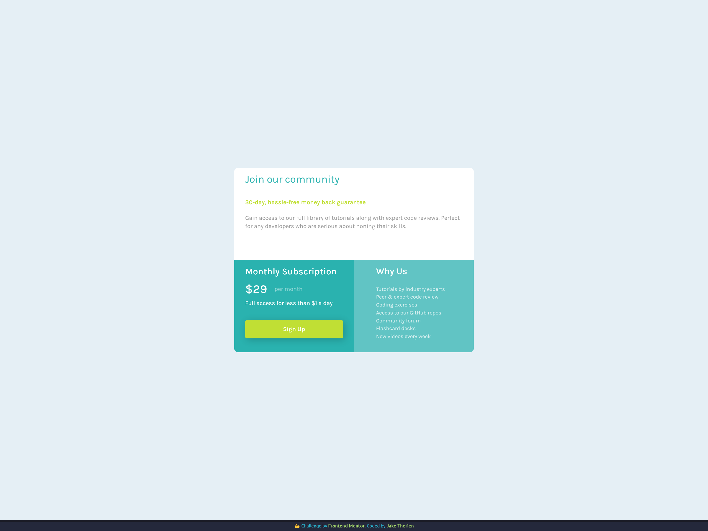

# Single Price Grid Component

## Table of contents
- [Overview](#overview)
  - [The challenge](#the-challenge)
  - [Screenshot](#screenshot)
  - [Links](#links)
- [My process](#my-process)
  - [Built with](#built-with)
  - [What I learned](#what-i-learned)
  - [Continued development](#continued-development)
- [Author](#author)

## Overview

### Screenshot

### Links

- Live Site URL: [GitHub Pages](https://jtherien.github.io/single-price-grid-component/)

## My process

### Built with
- Flexbox
- CSS Grid

### What I learned
There were many fine details and elements in this exercise that I needed to consider, especially when converting from
the desktop view to mobile. This really challenged how I thought about organizing my CSS in order to efficiently handle all of these rules

### Continued development
Explore mobile first workflows and learn how to start pre-planning my work so I can approach my CSS in the most efficient manner

## Author
- Github - [Jake Therien](https://github.com/JTherien)
- Frontend Mentor - [@JTherien](https://www.frontendmentor.io/profile/JTherien)